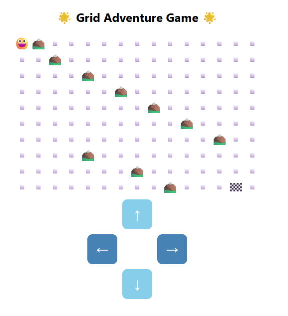
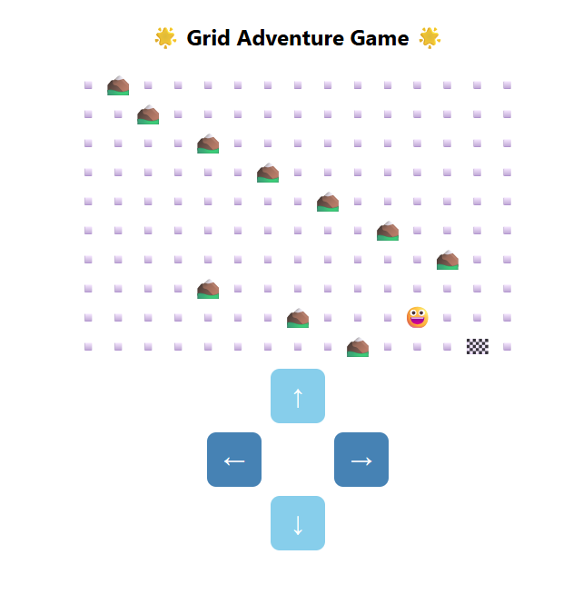
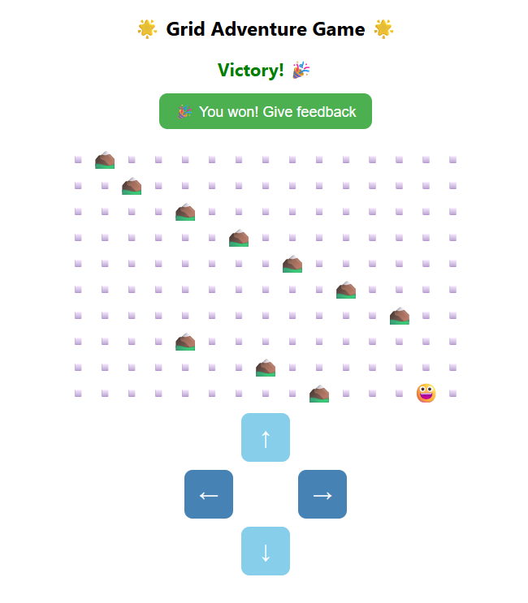
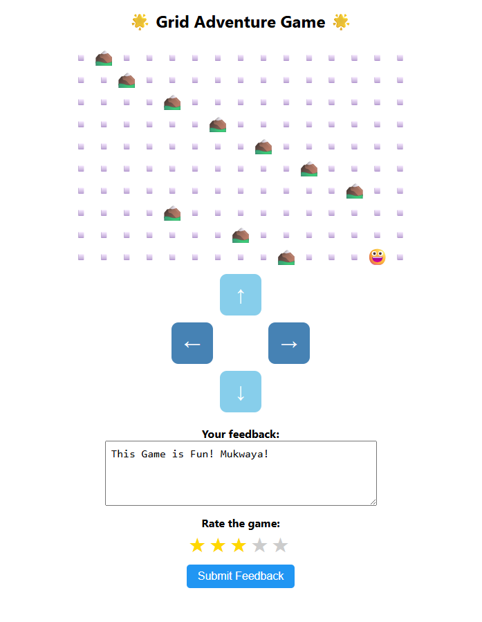
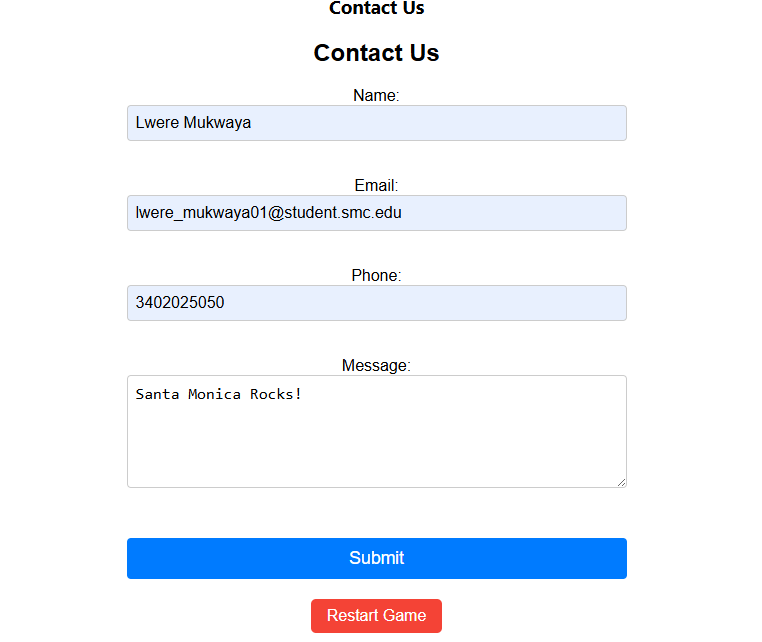
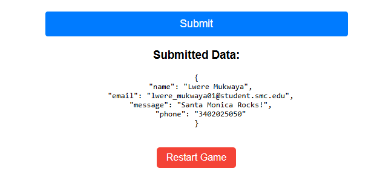

# Grid Adventure Game - Results & Visuals

---

## Game Overview

- This is the interactive **Grid Adventure Game**, a React-based web application where the player navigates a smiling emoji (😀) across a 10x15 grid toward a goal (🏁) while avoiding obstacles (⛰️). 
- The game includes keyboard and button controls, audio feedback, form-based user feedback, and a contact form dynamically loaded after feedback submission.

---

## Gameplay Screenshots

### 1. Initial Game State

*Player starts at the top-left corner, obstacles marked by mountains, goal is at bottom-right.*

---

### 2. Player Moving Through the Grid

*Player emoji (😀) moving around obstacles using keyboard or arrow buttons.*

---

### 3. Victory Screen

*On reaching the goal, the victory message and feedback button appear centered.*

---

### 4. Feedback Form

*User submitted feedback with star rating interface.*

---

### 5. Thank You and Contact Form

*After feedback submission, the dynamically loaded contact form appears.*

---

## Summary

- The game offers intuitive controls and real-time audio feedback.
- User feedback is handled with a star rating and text form, autosaved locally.
- The contact form loads only after feedback submission, optimizing performance.
- Responsive design and accessibility considerations are included.
  
---

